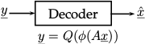
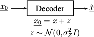
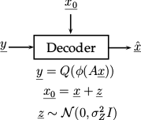

# SIGNAL RECOVERY FROM QUANTIZED SPARSIFIED MEASUREMENTS WITH IMPERFECT SIDE INFORMATION

## Introduction
1) The problem of recovering a signal x from a linear transform followed by element-wise non-linear measurements arises in a wide range of problems in signal processing, machine learning and communications.

The transform matrix can be either 

- undercomplete (for example, in the case of compressive sensing problems);

- orthonormal (for example, in the case of comression tasks);

- overcomplete (for example, in the case of problems related with retrieval).

The Shannon rate-distortion function is a lower theoretical bound for the formulated problem.

2) At the same time, a lot of attention is dedicated to the problem of signal estimation or denoising from a noisy measurement.

The maximum a posteriory estimation (MAP) is a lower theoretical bound for the for this type of problems.

3) New set up: a joint problem of recovering a generic signal x from sparsified and quantized measurements y = Q(phi(Ax)) with a generic matrix A, a sparsification operator phi(.), quantization Q(.) and with side information x0.

The several classes of linear transforms with orthogonal, overcomplete and undercomplete transform matrices followed by a non-linear sparsification and quantization operators have been investigated.
It was demonstrated the usefulness of injecting side information into the optimization formulation of advanced recovering technique such as gradient descent, its momentum acceleration and approximate message passing formulations.
I have been demonstrated how these algorithms achieve a lower theoretical bound on the accuracy of recovery.